<h2 style="color:#6f1802;">Portfolio</h2>
<h3 style="margin-bottom:0;">Urban Vegetation and Respiratory Health, Portland Oregon</h3>

  2 February 2026

Urban environments shape health in ways that are often visible from space. To explore how environmental structure relates to respiratory health, I combined high-resolution aerial imagery with census-tract asthma prevalence estimates. Rather than measuring only how much vegetation exists, this analysis focuses on how vegetation is arranged across neighborhoods, specifically, how fragmented or continuous green cover is within each census tract.  

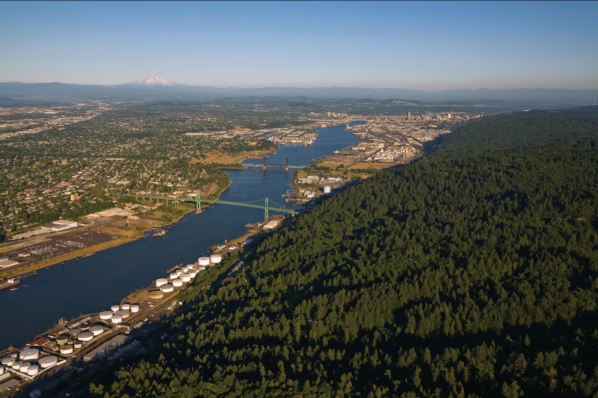Portland, Oregon is widely recognized for its urban forests, parks, and green infrastructure, and is often cited as one of the greener metropolitan areas in the United States. At the same time, Portland’s landscape is highly uneven: large, contiguous forested areas such as Forest Park contrast with dense, redeveloped neighborhoods where vegetation is distributed in smaller, fragmented patches. This variation creates an opportunity to examine how differences in urban vegetation structure relate to modeled respiratory health patterns across the city.   

By pairing vegetation structure metrics with modeled asthma prevalence from the CDC PLACES dataset, this analysis looks at how urban landscape patterns and respiratory health vary together across Portland.

<b>Background</b> 
Two datasets define the study area:
<ul><li><b>Health Data:</b> CDC PLACES 2023 census-tract estimates of adult asthma prevalence for Multnomah County, Oregon.</li>
<li><b>Environmental Data:</b> National Agriculture Imagery Program (NAIP) aerial imagery, used to compute NDVI and derive vegetation structure metrics.</li></ul>

NDVI (Normalized Difference Vegetation Index) is widely used for vegetation monitoring because it reflects canopy density, greenness, and photosynthetic activity. In urban environments, NDVI can distinguish vegetated from built surfaces and provide a consistent basis for comparing landscape structure across neighborhoods.

Portland provides an interesting planning and environmental context. Regional growth management through the Urban Growth Boundary has encouraged infill development and higher density rather than outward expansion. Communities such as Gresham have transitioned from lower-density suburban form toward more compact, transit-oriented development. At the same time, Portland has been recognized for green stormwater infrastructure and urban greening efforts, while local reporting highlights ongoing changes in tree canopy and vegetation along redevelopment corridors and trails.

<b>Research Question</b> 
How does vegetation structure vary across Portland census tracts, and how do those patterns align with modeled asthma prevalence?

<b>Data and Methods</b>
<ul><li><b>Asthma Data:</b> CDC PLACES tract-level estimates of current adult asthma prevalence (2023).</li>
<li><b>Imagery:</b> NAIP multispectral imagery (1 m resolution) accessed through a STAC catalog.</li>
<li><b>Vegetation Metric:</b> NDVI was calculated from NAIP near-infrared and red bands using the standard normalized difference formula:</li></ul>
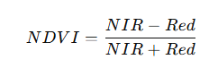 
Pixels with NDVI > 0.3 were classified as vegetation.  
For each census tract, imagery was clipped to tract boundaries and vegetation structure metrics were calculated, including:
<ul><li>Fraction of vegetated pixels</li>
<li>Mean vegetation patch size</li>
<li>Vegetation edge density (amount of boundary between vegetation and non-vegetation)</li></ul>
These environmental metrics were then joined with asthma prevalence values by tract.

<b>Results</b> 
  

    <iframe
      src="img/portland_asthma_map.html"
      title="Asthma Prevalence Across Portland"
      style="
        width:600px;
        height:600px;
        border:0;
        display:block;
        margin:0;
      ">
    </iframe>
  

<figcaption style="font-size:0.9em; color:#555; margin:6px 0 0 0;">
    <b>Figure 1: Asthma Prevalence Across Portland</b>  Modeled adult asthma prevalence (%) by census tract in Portland, Oregon (CDC PLACES, 2023). Higher prevalence values cluster in parts of north, northeast, and eastern Portland toward Gresham, while southwest Portland and the Forest Park / West Hills area show lower estimated prevalence.
  </figcaption>
  
    

<iframe src="img/portland_asthma_edge_density.html" width="600" height="350" style="border:none;"></iframe>

  <figcaption style="font-size:0.9em; color:#555; margin:0px 0 0 0;">
    <b>Figure 2: Asthma Prevalence and Vegetation Edge Density</b>  Left: Modeled adult asthma prevalence (%) by census tract in Portland (CDC PLACES, 2023). Right: Vegetation edge density derived from NAIP NDVI. Higher edge density values indicate more fragmented vegetation, while lower values reflect larger, more continuous green areas. Continuous canopy areas such as Forest Park and the West Hills appear with low edge density, while more densely built neighborhoods in east Portland and toward Gresham show higher fragmentation.</figcaption> 
    
To explore how well vegetation structure predicts asthma prevalence, I trained a regression model using vegetation metrics as predictors and mapped the residual error.
  

    <iframe
      src="img/portland_model_error.html"
      title="Model Error Map"
      style="
        width:600px;
        height:600px;
        border:0;
        display:block;
        margin:0;
      ">
    </iframe>
  

<figcaption style="font-size:0.9em; color:#555; margin:6px 0 0 0;">
    <b>Figure 3: Model Error in Predicted Asthma Prevalence</b>  Model residuals (predicted − measured asthma prevalence) by census tract. Red tones indicate areas where the model underpredicts asthma prevalence (measured values are higher than predicted), while blue tones indicate areas where the model overpredicts prevalence. Spatial clustering of error suggests that vegetation structure alone does not capture all factors influencing respiratory health patterns across Portland.</figcaption>

 <b>Interpretation</b> 
The asthma and vegetation maps do not mirror each other directly, which is expected. Vegetation structure is only one of many factors influencing respiratory health. 
However, several patterns stand out:
<ul><li>Tracts with more fragmented vegetation often align with denser urban areas</li>
<li>Areas with larger, more continuous vegetation patches sometimes show lower asthma prevalence</li>
<li>Model error clusters geographically, indicating that additional variables, such as traffic exposure, housing conditions, or socioeconomic factors, likely play important roles</li></ul>
Portland’s land use history helps frame these observations. Growth management policies have concentrated development inside the metro area, encouraging redevelopment and infill. This reshaping of neighborhood form can increase vegetation fragmentation even when green infrastructure investments are present. Meanwhile, local discussions about tree canopy change and green stormwater systems show that urban vegetation is both dynamic and unevenly distributed. 

<b>References</b> 
ArcGIS StoryMaps. Regional planning and growth boundary context for Portland and the metro area.
https://storymaps.arcgis.com/stories/ce2073fccfa148319ef25980b662b08b

Centers for Disease Control and Prevention (CDC). (2023). PLACES: Local Data for Better Health — modeled estimates of adult asthma prevalence by census tract. U.S. Department of Health and Human Services.
https://www.cdc.gov/places/

Green City Times. Portland local news and features on urban greening and city life. https://www.greencitytimes.com/portland/

KGW News. Tree canopy change and urban vegetation along the Springwater Corridor.
https://www.kgw.com/article/news/local/gresham-lumberjack-cut-down-trees-springwater-trail/283-95cb20a3-a10a-40a1-9696-3e757ca3cb7d

Oregon Public Broadcasting. (2025, August 27). Think Out Loud: Study says Portland is a national leader in green stormwater infrastructure.
https://www.opb.org/article/2025/08/27/think-out-loud-study-says-portland-national-leader-green-stormwater-infrastructure/

Tucker, C. J. (1979). Red and photographic infrared linear combinations for monitoring vegetation. Remote Sensing of Environment, 8, 127–150.

U.S. Department of Agriculture Farm Service Agency & U.S. Geological Survey. (n.d.). National Agriculture Imagery Program (NAIP). High-resolution aerial multispectral imagery.

Wilkes East Neighborhood Association. Community planning and development context in East Portland.
https://wilkeseastna.org/node/3713

***
<h3 style="margin-bottom:0;">Vegetation Loss and Recovery Following the Eagle Creek Fire</h3>

  9 December 2025

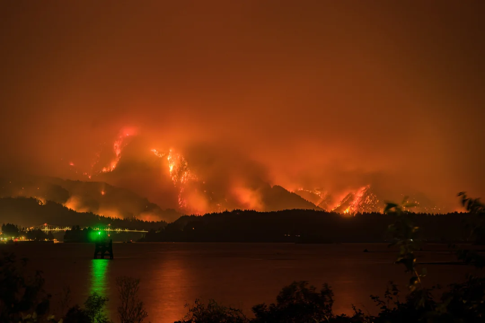In September 2017, the Eagle Creek Fire burned nearly 50,000 acres in the Columbia River Gorge. To evaluate how vegetation changed in response, I used satellite-derived NDVI (Normalized Difference Vegetation Index) to quantify the immediate reduction in greenness and the subsequent recovery over the seven years following the fire. By comparing NDVI inside the burn perimeter to a nearby unburned portion of the Mark O. Hatfield Wilderness, this analysis provides a consistent framework for assessing both the initial vegetation loss and the rate of post-fire recovery.

<b>Background</b> 
Two spatial datasets define the study area:
<ul><li>Burned Region: The Monitoring Trends in Burn Severity (MTBS) 2017 Eagle Creek Fire perimeter</li>
<li>Comparison Region: A 3 km outside ring clipped from the Mark O. Hatfield Wilderness</li></ul>

NDVI is widely used for vegetation monitoring because it reflects canopy density, greenness, and photosynthetic activity. NDVI provides a consistent measure of vegetation greenness and canopy characteristics (Tucker, 1979), which makes it useful for evaluating changes in dense conifer forest and nearby mixed-vegetation areas.

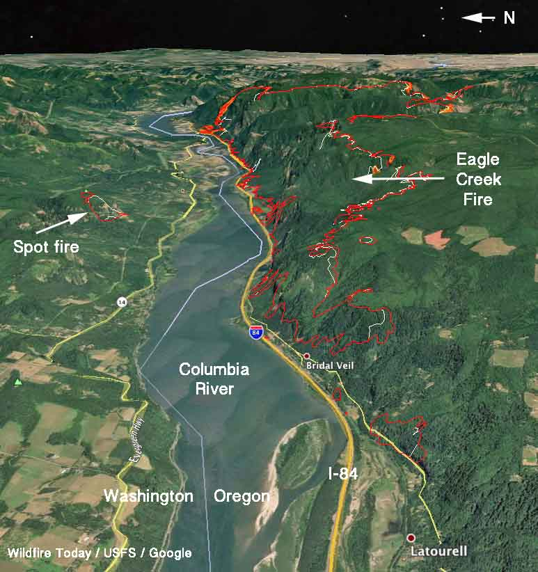Although intended as a comparison region, the 3 km ring is not an ecological duplicate of the interior burn area, and these differences help explain pre-fire NDVI patterns. The MTBS burn area consists of steep canyon walls that are dominated by dense conifers. The surrounding ring includes mixed forest, shrubland, and ridge-top terrain.

<b>Research Question</b> 
How much vegetation was lost during the Eagle Creek Fire, and how has NDVI changed inside the burn perimeter relative to the surrounding Hatfield Wilderness from 2014 to 2024?

<b>Data and Methods</b>
<ul><li>NDVI Data: MODIS MOD13Q1.061, 250 meter resolution, August composites for 2014 to 2024.</li>
<li>Burn Perimeter: MTBS 2017 Eagle Creek Fire boundary.</li>
<li>Comparison Region: 3 km outside ring intersected with the Hatfield Wilderness polygon.</li></ul>

For each year, NDVI values were clipped to both regions, and mean NDVI was calculated to construct a time series. Additional spatial products include:
<ul><li>NDVI difference for 2018 minus 2016, which represents immediate post-fire vegetation loss</li>
<li>NDVI difference for 2024 minus 2016, which reflects longer-term recovery</li></ul>
To measure recovery within the burned area, I computed a pixel-wise recovery ratio:

A ratio near 1 represents NDVI returning to pre-fire levels and a ratio near 0 represents limited recovery.

<b>Results</b> 
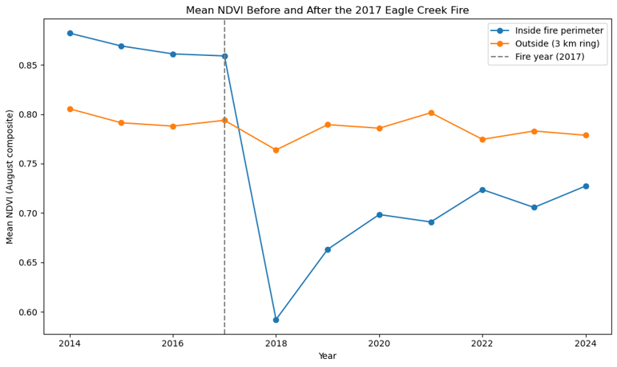
  <figcaption style="font-size:0.9em; color:#555; margin:0px 0 0 0;">
    <b>Figure 1: Time Series for 2014 to 2024</b> Before the fire, from 2014 to 2016, NDVI was higher inside the MTBS perimeter because of dense conifer canopy. In 2018, NDVI dropped sharply inside the perimeter. From 2019 to 2024, NDVI increased gradually. NDVI in the outside region remained nearly constant through the entire period.</figcaption>

 <b>Why Pre-fire NDVI Is Higher Inside the Burn Perimeter</b> 
Before the fire, NDVI inside the MTBS perimeter was consistently higher, around 0.86 to 0.88, than in the outside ring, which averaged around 0.79 to 0.81. This pattern is expected because dense conifer canopy maintains high late-summer NDVI, shaded terrain retains strong greenness, and the outside ring includes vegetation types that tend to show lower August NDVI values.

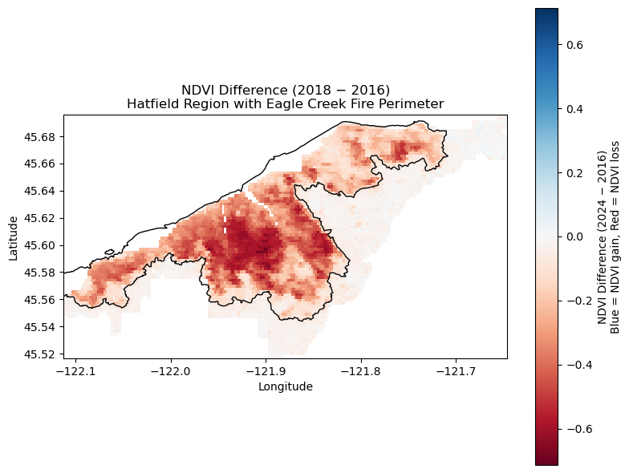
  <figcaption style="font-size:0.9em; color:#555; margin:0px 0 0 0;">
    <b>Figure 2: Immediate Impact for 2018 minus 2016</b> NDVI within the MTBS perimeter shows a clear reduction between 2016 and 2018, which is consistent with canopy loss. The comparison region remains unchanged, and this demonstrates that observed declines inside the perimeter reflect fire effects rather than regional variation.</figcaption>
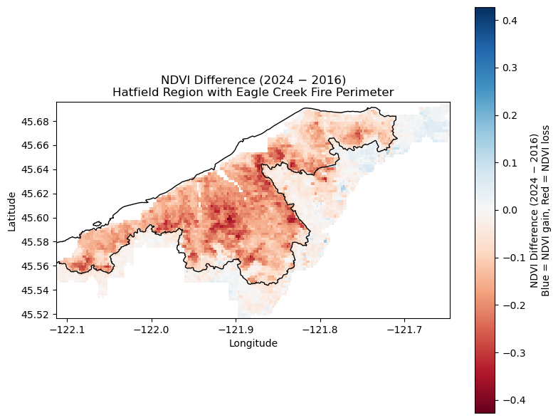
  <figcaption style="font-size:0.9em; color:#555; margin:0px 0 0 0;">
    <b>Figure 3: Recovery Through 2024 for 2024 minus 2016</b> NDVI inside the burn perimeter increased steadily after 2018. By 2024, regrowth is evident across much of the landscape, although NDVI has not fully returned to pre-fire levels. Recovery is spatially heterogeneous, with drainages and mixed-vegetation patches recovering more quickly than ridge tops and high-severity burn zones.</figcaption>
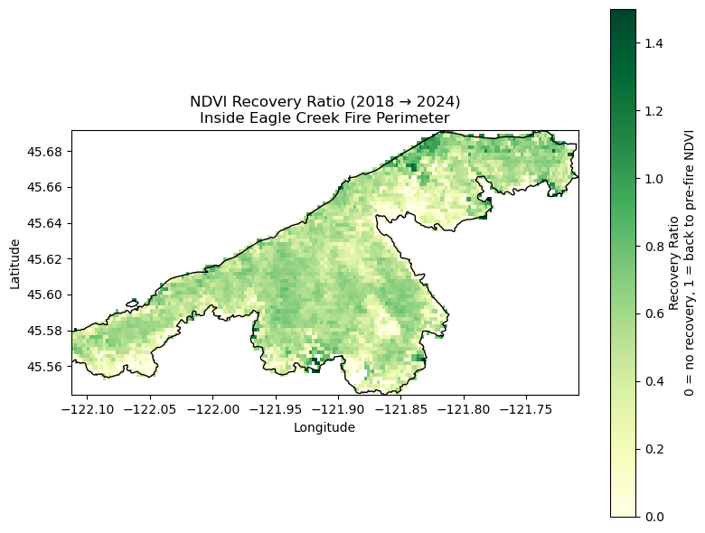
  <figcaption style="font-size:0.9em; color:#555; margin:0px 0 0 0;">
    <b>Figure 4: Recovery Ratio Map</b> NDVI recovery ratio for the Eagle Creek Fire area. Dark green values near 1.0 indicate substantial recovery toward pre-fire greenness. Light yellow values near 0 indicate limited recovery. Pixels with negligible initial NDVI loss were excluded.</figcaption>

 <b>Landslide Data Integration</b> 
To provide broader geophysical context, I incorporated 2021 mapped landslide polygons from the USGS Columbia River Gorge dataset (Mathews et al., 2025). Twelve mapped landslides fall within the MTBS perimeter.

When these landslides are plotted on the NDVI recovery imagery, a resolution mismatch becomes clear. MODIS NDVI pixels are 250 meters, while most mapped landslides are tens of meters across. Because of this, individual slope failures do not produce detectable NDVI signatures at MODIS scale. Even so, including the landslide data highlights the difference in spatial scale between geomorphic processes and coarse-resolution vegetation monitoring.

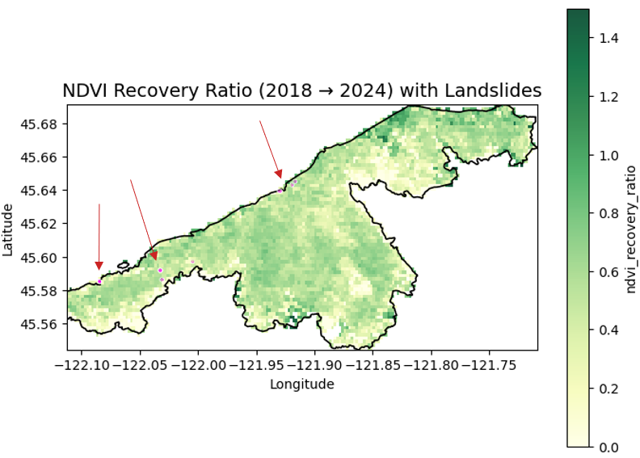
  <figcaption style="font-size:0.9em; color:#555; margin:0px 0 0 0;">
    <b>Figure 5:</b>Mapped landslides, shown in pink, plotted over NDVI recovery to illustrate the resolution mismatch between landslide footprints and MODIS pixel size.</figcaption>

 <b>Interpretation</b> 
The Eagle Creek Fire produced a measurable NDVI decline followed by gradual, spatially variable recovery. Seven years after the fire, regrowth is evident across much of the landscape but NDVI has not fully returned to pre-fire levels. The comparison region, although not an exact ecological match, remained stable throughout the study period and provides a consistent baseline for interpreting change inside the burn perimeter.

The addition of landslide data illustrates the challenge of combining fine-scale geotechnical information with coarse-resolution remote sensing products, and it highlights the importance of considering spatial scale when interpreting post-fire landscape processes.

<a href="https://tkbravo.github.io/img/fire.html" target="_blank">View the full analysis</a>

<b>References</b> 
Tucker, C. J. (1979). Red and photographic infrared linear combinations for monitoring vegetation. Remote Sensing of Environment, 8, 127 to 150.
MTBS Project, USFS and USGS. 2017. Eagle Creek Fire, Burn Severity and Perimeter. <a href="https://mtbs.gov" target="_blank">https://mtbs.gov</a>
NASA LP DAAC. MOD13Q1.061 MODIS Terra Vegetation Indices. <a href="https://lpdaac.usgs.gov" target="_blank">https://lpdaac.usgs.gov</a>
OpenStreetMap contributors. 2025. Mark O. Hatfield Wilderness, map. <a href="https://www.openstreetmap.org/relation/6087908" target="_blank">https://www.openstreetmap.org/relation/6087908</a>
Mathews, N. W., Leshchinsky, B. A., Sousa, D., Sanders, M., Presler, P., and Roering, J. J. (2025). Hydrological, geotechnical, and landslide mapping data from the Columbia River Gorge, Oregon to support physics-based modeling of postfire shallow landslides. U.S. Geological Survey data release. <a href="https://doi.org/10.5066/P1QHQHAM" target="_blank">https://doi.org/10.5066/P1QHQHAM</a>
    
***
<h3 style="margin-bottom:0;">NDVI Seasonality and Variability Across the Gila River Indian Community (2001–2022)</h3>

  30 November 2025

Using a multiyear NDVI dataset clipped to the Gila River Indian Community (GRIC) boundary, I examined how vegetation greenness varies inside and outside the reservation. NDVI (Normalized Difference Vegetation Index) approximates vegetation vigor and canopy density. This analysis focuses on two questions: how vegetation behaves through the seasons (phenology) and how stable or variable it is from year to year.

<b>Seasonal Patterns</b> 
Monthly NDVI averages show a clear difference between the two regions. Outside GRIC, vegetation is consistently greener, with mean NDVI values around 0.22–0.24 from May through August. Inside GRIC, NDVI is lower in all months (roughly 0.18–0.21) but follows a similar upward trend into late summer. This pattern suggests that vegetation outside the reservation, which includes more irrigated and developed land, maintains higher overall greenness than the drier, more sparsely vegetated lands inside GRIC.

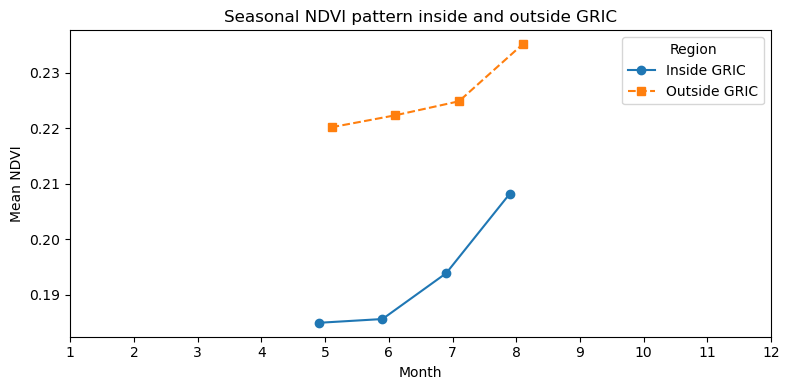
  <figcaption style="font-size:0.9em; color:#555; margin:0px 0 0 0;">
    <b>Figure 1</b>. Mean monthly NDVI for May–August inside and outside the Gila River Indian Community. Outside GRIC remains consistently greener, with slightly higher seasonal amplitude, while inside GRIC shows lower but parallel greening through late summer.</figcaption>

<b>Year-to-Year Variability</b> 
Year-to-year NDVI variability shows a generally stable pattern inside and outside GRIC from 2001 through 2020. Variance values remain very low for both regions, which is characteristic of arid landscapes with sparse perennial vegetation.
  
In 2021, both regions exhibit a sharp increase in NDVI variance, with a larger jump inside GRIC. This spike likely reflects a combination of environmental and data-related factors. Much of central and southern Arizona experienced an extreme drought that year, as documented by NOAA’s National Integrated Drought Information System (NIDIS), which reported widespread severe to exceptional drought conditions across the state in 2021. Patchy vegetation responses to limited monsoon rains can create large spatial contrasts that raise NDVI variance. Outside GRIC, where vegetation includes a mix of irrigated fields and natural desert, the increase is noticeable but smaller.

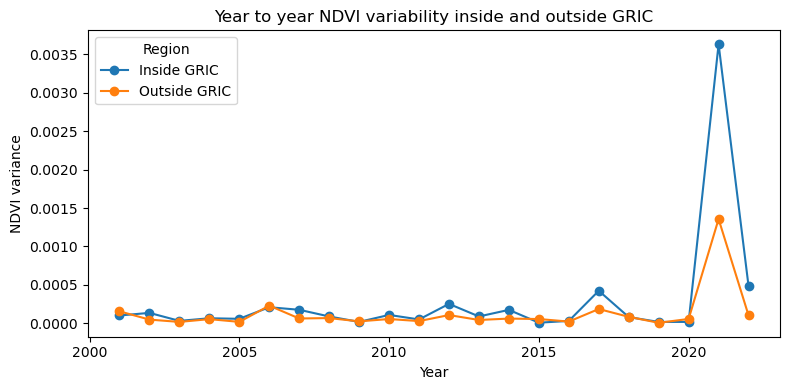
  <figcaption style="font-size:0.9em; color:#555; margin:0px 0 0 0;">
    <b>Figure 2</b>. Year-to-year NDVI variance for inside and outside GRIC. Both regions show low interannual variability from 2001 to 2020. Variance rises sharply in 2021, especially inside GRIC, likely reflecting spatially uneven vegetation responses during a drought year. Variability declines again in 2022.</figcaption>

  
Variance decreases again in 2022, returning closer to long-term levels. Taken together, the long-term pattern shows that vegetation inside GRIC is generally less variable from year to year than vegetation in surrounding areas, except during years of substantial climate stress.

<b>Interpretation</b> 
Together, the seasonal and variability patterns provide a view of how vegetation responds to long-term water conditions across the region. The lower seasonal amplitude and greater stability inside GRIC reflect drought-adapted vegetation and limited access to surface water. Outside GRIC, stronger seasonal pulses and higher variability are linked to irrigation and more water-responsive landscapes.

<b>Data and Methods</b> 
The dataset available for this exercise contained NDVI scenes from May through August for each year, which represent the primary growing season in this region. Seasonal patterns are interpreted within this time window.
MODIS NDVI composites (2001 to 2022), GRIC boundary polygons, GeoPandas clipping, group-by operations for monthly and annual summaries, and matplotlib for visualization.

<b>References</b> 
Arizona State University Geography Alliance. The Gila River: A Story of Water and Change. <a href="https://geoalliance.asu.edu/sites/g/files/litvpz866/files/LessonFiles/Warren/River/WarrenRivS.pdf" target="_blank">https://geoalliance.asu.edu/sites/g/files/litvpz866/files/LessonFiles/Warren/River/WarrenRivS.pdf</a>
National Integrated Drought Information System (NIDIS). Exceptional Southwest Drought Exacerbated by Human-Caused Warming. <a href="https://www.drought.gov/news/new-noaa-report-exceptional-southwest-drought-exacerbated-human-caused-warming" target="_blank">https://www.drought.gov/news/new-noaa-report-exceptional-southwest-drought-exacerbated-human-caused-warming</a>
USGS. Normalized Difference Vegetation Index (NDVI) Overview. 
MODIS Land Products. NASA LP DAAC.

***
<h3 style="margin-bottom:0;">Vaux’s Swift Migration Along the Pacific Flyway (2023)</h3>

  28 October 2025

Using occurrence records from 2023 available through the Global Biodiversity Information Facility (GBIF), I mapped Vaux’s swift (Chaetura vauxi) observations by month, joined to EPA ecoregions, and adjusted counts to account for uneven sampling effort. The results show northbound movements in April–May and southbound passage in August–September, with the highest concentrations along the Pacific coast and lower Cascade ecoregions, patterns consistent with the species’ known migration routes.

Vaux’s swifts spend most of their lives aloft, feeding, drinking, courting, and even collecting nesting material in flight. During fall migration, thousands gather at communal roosts such as Portland’s Chapman Elementary School chimney, the largest known in the world. Each evening, flocks circle in tightening spirals before dropping inside to cling to the rough interior walls, where they roost overnight for warmth and safety. At dawn, the birds erupt back into the air and continue south toward Central America and Venezuela.

Historically, the species nested in the hollow trunks of old-growth trees. As those forests declined, swifts began using brick chimneys as substitutes, taking advantage of their similar structure and rough surfaces for clinging. Once a suitable site is found, they often return year after year, using it for nesting in summer or as a temporary refuge during migration.

The interactive map illustrates this seasonal rhythm, a clear north–south shift between spring and fall. Concentrations along coastal and Cascade ecoregions highlight the Pacific Flyway as the primary corridor for the species. 

<b>Vaux’s Swift Migration 2023</b>

  <iframe
    src="img/vaux_migration.html"
    title="Vaux's Swift Migration Map"
    style="
      width:1068px;
      height:942px;
      border:0;
      display:block;
      transform:scale(0.5618);
      transform-origin:0 0;
      margin:0;
    ">
  </iframe>

  <figcaption style="font-size:0.9em; color:#555; margin:6px 0 0 0;">
    <b>Figure 1</b>. Monthly distribution of Chaetura vauxi observations across EPA ecoregions, adjusted for sampling effort. Northbound migration peaks in April–May; southbound passage peaks in August–September.
  </figcaption>

 I selected 2023 as a representative migration year with consistent observer coverage across the Pacific Flyway. EPA ecoregions provide a standardized spatial framework, and adjusting counts for effort helps reduce bias in citizen-science data.

<b>Data & methods</b> 
GBIF occurrence data (tab-delimited CSV), EPA ecoregions, GeoPandas spatial join, monthly/ecoregion group-by, effort adjustment, and hvPlot/Panel for visualization. Duplicate records and repeated checklist submissions were filtered to unique eventIDs per month and ecoregion to minimize oversampling at known roost locations.

<b>References</b> 
GBIF.org (28 October 2025) GBIF Occurrence Download <a href="https://doi.org/10.15468/dl.5x7k7q" target="_blank">https://doi.org/10.15468/dl.5x7k7q</a> 
Bird Alliance of Oregon. (n.d.). Vaux’s Swifts. Retrieved October 28, 2025, from <a href="https://birdallianceoregon.org/our-work/rehabilitate-wildlife/having-a-wildlife-problem/vauxs-swifts/" target="_blank">https://birdallianceoregon.org/our-work/rehabilitate-wildlife/having-a-wildlife-problem/vauxs-swifts/</a> 
GBIF Secretariat. (n.d.). Chaetura vauxi (J.K. Townsend, 1839). Retrieved October 28, 2025, from <a href="https://www.gbif.org/species/5228612" target="_blank">https://www.gbif.org/species/5228612</a>

***
<h3 style="margin-bottom:0;">50 Years of Warming in Portland, OR (1959-2009)</h3>

  29 September 2025

Over 50 years, Portland, Oregon has warmed at an average rate of 0.016 °C per year (about 0.16 °C per decade), based on NOAA’s Global Historical Climatology Network Daily (GHCND) dataset (NOAA NCEI, 2024a). This rate is slightly lower than the global average warming calculated by NOAA for 1982–2023 (0.20 °C per decade) (NOAA NCEI, 2024b), but it still represents a clear long-term warming signal. The R² value of 0.088 shows that much of the year-to-year variation comes from natural climate variability, yet the overall slope remains positive.

<figure style="text-align:center;">
  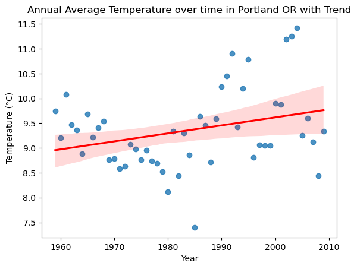
  <figcaption style="font-size:0.9em; color:#555; margin-top:6px;">
    <b>Figure 1</b>. Annual average temperature in Portland, OR 
    (NOAA GHCND Station USC00358634, 1959–2009) with linear regression 
    trend line and 95% confidence interval.
  </figcaption>
</figure>

Portland’s proximity to the Pacific Ocean means its climate is strongly influenced by large-scale patterns such as the Pacific Decadal Oscillation (PDO) (NOAA PSL, 2024) and the El Niño–Southern Oscillation (ENSO) (NOAA Climate.gov, 2024). These oscillations can mask or amplify the underlying warming trend. For example, the late 1970s and early 1980s show a stretch of cooler years that align with a cool phase of the PDO, while the 1990s and the 2010s contain clusters of notably warm years, some coinciding with strong El Niño events. These alternating cool and warm stretches illustrate the “noise” of natural variability on top of the long-term trend.

Background research on regional climate (ClimateStations, 2024) describes Portland’s climate as mild, with wet winters and dry summers, moderated by maritime influences. That Portland shows a persistent warming trend despite this moderation underscores the broader signal of climate change in the Pacific Northwest.

<a href="https://tkbravo.github.io/img/09_Portfolio_Climate_Portland.html" target="_blank">View the full climate analysis</a>

<b>References</b>

  ClimateStations. (2024). Portland, OR Climate Information. Retrieved from 
  <a href="https://www.climatestations.com/portland-or/" target="_blank">https://www.climatestations.com/portland-or/</a> 
  
  NOAA Climate.gov. (2024). El Niño–Southern Oscillation (ENSO) Overview. Retrieved from 
  <a href="https://www.climate.gov/enso" target="_blank">https://www.climate.gov/enso</a> 
  
  NOAA NCEI. (2024a). Global Historical Climatology Network Daily (GHCND): Troutdale, OR (USC00358634). Retrieved from 
  <a href="https://www.ncdc.noaa.gov/cdo-web/datasets/GHCND/stations/GHCND:USC00358634/detail" target="_blank">https://www.ncdc.noaa.gov/cdo-web/datasets/GHCND/stations/GHCND:USC00358634/detail</a> 
  
  NOAA NCEI. (2024b). Climate at a Glance: Global Time Series. Retrieved from 
  <a href="https://www.ncei.noaa.gov/access/monitoring/climate-at-a-glance/" target="_blank">https://www.ncei.noaa.gov/access/monitoring/climate-at-a-glance/</a> 
  
  NOAA PSL. (2024). Pacific Decadal Oscillation (PDO) Index. Retrieved from 
  <a href="https://www.ncei.noaa.gov/access/monitoring/pdo/" target="_blank">https://www.ncei.noaa.gov/access/monitoring/pdo/</a>

 

***

<h3 style="margin-bottom:0;">Map from OpenStreetMap</h3>

  8 September 2025

This interactive map in Python highlights the central campus of Indiana University in Bloomington, Indiana. The flagship campus of the IU system, it is a major public research institution, and the map shows its academic buildings, administrative areas, and green spaces.
<embed type="text/html" src="img/start.html" width="600" height="600">
