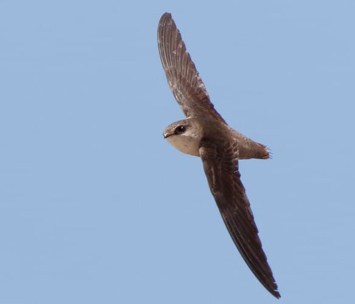

<h2 style="color:#6f1802;">Portfolio</h2>
<h3 style="margin-bottom:0;">NDVI Seasonality and Variability Across the Gila River Indian Community (2001–2022)</h3>

  30 November 2025

Using a multiyear NDVI dataset clipped to the Gila River Indian Community (GRIC) boundary, I examined how vegetation greenness varies inside and outside the reservation. NDVI (Normalized Difference Vegetation Index) approximates vegetation vigor and canopy density. This analysis focuses on two questions: how vegetation behaves through the seasons (phenology) and how stable or variable it is from year to year.

<b>Seasonal Patterns</b> 
Monthly NDVI averages show a clear difference between the two regions. Outside GRIC, vegetation is consistently greener, with mean NDVI values around 0.22–0.24 from May through August. Inside GRIC, NDVI is lower in all months (roughly 0.18–0.21) but follows a similar upward trend into late summer. This pattern suggests that vegetation outside the reservation, which includes more irrigated and developed land, maintains higher overall greenness than the drier, more sparsely vegetated lands inside GRIC.

  <figcaption style="font-size:0.9em; color:#555; margin:0px 0 0 0;">
    <b>Figure 1</b>. Mean monthly NDVI for May–August inside and outside the Gila River Indian Community. Outside GRIC remains consistently greener, with slightly higher seasonal amplitude, while inside GRIC shows lower but parallel greening through late summer.</figcaption>

<b>Year-to-Year Variability</b> 
Year-to-year NDVI variability shows a generally stable pattern inside and outside GRIC from 2001 through 2020. Variance values remain very low for both regions, which is characteristic of arid landscapes with sparse perennial vegetation.
  
In 2021, both regions exhibit a sharp increase in NDVI variance, with a larger jump inside GRIC. This spike likely reflects a combination of environmental and data-related factors. Much of central and southern Arizona experienced an extreme drought that year, as documented by NOAA’s National Integrated Drought Information System (NIDIS), which reported widespread severe to exceptional drought conditions across the state in 2021. Patchy vegetation responses to limited monsoon rains can create large spatial contrasts that raise NDVI variance. Outside GRIC, where vegetation includes a mix of irrigated fields and natural desert, the increase is noticeable but smaller.

  <figcaption style="font-size:0.9em; color:#555; margin:0px 0 0 0;">
    <b>Figure 2</b>. Year-to-year NDVI variance for inside and outside GRIC. Both regions show low interannual variability from 2001 to 2020. Variance rises sharply in 2021, especially inside GRIC, likely reflecting spatially uneven vegetation responses during a drought year. Variability declines again in 2022.</figcaption>

  
Variance decreases again in 2022, returning closer to long-term levels. Taken together, the long-term pattern shows that vegetation inside GRIC is generally less variable from year to year than vegetation in surrounding areas, except during years of substantial climate stress.

<b>Interpretation</b> 
Together, the seasonal and variability patterns provide a view of how vegetation responds to long-term water conditions across the region. The lower seasonal amplitude and greater stability inside GRIC reflect drought-adapted vegetation and limited access to surface water. Outside GRIC, stronger seasonal pulses and higher variability are linked to irrigation and more water-responsive landscapes.

<b>Data and Methods</b> 
The dataset available for this exercise contained NDVI scenes from May through August for each year, which represent the primary growing season in this region. Seasonal patterns are interpreted within this time window.
MODIS NDVI composites (2001 to 2022), GRIC boundary polygons, GeoPandas clipping, group-by operations for monthly and annual summaries, and matplotlib for visualization.

<b>References</b> 
Arizona State University Geography Alliance. The Gila River: A Story of Water and Change. <a href="https://geoalliance.asu.edu/sites/g/files/litvpz866/files/LessonFiles/Warren/River/WarrenRivS.pdf" target="_blank">https://geoalliance.asu.edu/sites/g/files/litvpz866/files/LessonFiles/Warren/River/WarrenRivS.pdf</a>
National Integrated Drought Information System (NIDIS). Exceptional Southwest Drought Exacerbated by Human-Caused Warming. <a href="https://www.drought.gov/news/new-noaa-report-exceptional-southwest-drought-exacerbated-human-caused-warming" target="_blank">https://www.drought.gov/news/new-noaa-report-exceptional-southwest-drought-exacerbated-human-caused-warming</a>
USGS. Normalized Difference Vegetation Index (NDVI) Overview. 
MODIS Land Products. NASA LP DAAC.

***
<h3 style="margin-bottom:0;">Vaux’s Swift Migration Along the Pacific Flyway (2023)</h3>

  28 October 2025

Using occurrence records from 2023 available through the Global Biodiversity Information Facility (GBIF), I mapped Vaux’s swift (Chaetura vauxi) observations by month, joined to EPA ecoregions, and adjusted counts to account for uneven sampling effort. The results show northbound movements in April–May and southbound passage in August–September, with the highest concentrations along the Pacific coast and lower Cascade ecoregions, patterns consistent with the species’ known migration routes.

Vaux’s swifts spend most of their lives aloft, feeding, drinking, courting, and even collecting nesting material in flight. During fall migration, thousands gather at communal roosts such as Portland’s Chapman Elementary School chimney, the largest known in the world. Each evening, flocks circle in tightening spirals before dropping inside to cling to the rough interior walls, where they roost overnight for warmth and safety. At dawn, the birds erupt back into the air and continue south toward Central America and Venezuela.

Historically, the species nested in the hollow trunks of old-growth trees. As those forests declined, swifts began using brick chimneys as substitutes, taking advantage of their similar structure and rough surfaces for clinging. Once a suitable site is found, they often return year after year, using it for nesting in summer or as a temporary refuge during migration.

The interactive map illustrates this seasonal rhythm, a clear north–south shift between spring and fall. Concentrations along coastal and Cascade ecoregions highlight the Pacific Flyway as the primary corridor for the species. 

<b>Vaux’s Swift Migration 2023</b>

  <iframe
    src="img/vaux_migration.html"
    title="Vaux's Swift Migration Map"
    style="
      width:1068px;
      height:942px;
      border:0;
      display:block;
      transform:scale(0.5618);
      transform-origin:0 0;
      margin:0;
    ">
  </iframe>

  <figcaption style="font-size:0.9em; color:#555; margin:6px 0 0 0;">
    <b>Figure 1</b>. Monthly distribution of Chaetura vauxi observations across EPA ecoregions, adjusted for sampling effort. Northbound migration peaks in April–May; southbound passage peaks in August–September.
  </figcaption>

 I selected 2023 as a representative migration year with consistent observer coverage across the Pacific Flyway. EPA ecoregions provide a standardized spatial framework, and adjusting counts for effort helps reduce bias in citizen-science data.

<b>Data & methods</b> 
GBIF occurrence data (tab-delimited CSV), EPA ecoregions, GeoPandas spatial join, monthly/ecoregion group-by, effort adjustment, and hvPlot/Panel for visualization. Duplicate records and repeated checklist submissions were filtered to unique eventIDs per month and ecoregion to minimize oversampling at known roost locations.

<b>References</b> 
GBIF.org (28 October 2025) GBIF Occurrence Download <a href="https://doi.org/10.15468/dl.5x7k7q" target="_blank">https://doi.org/10.15468/dl.5x7k7q</a> 
Bird Alliance of Oregon. (n.d.). Vaux’s Swifts. Retrieved October 28, 2025, from <a href="https://birdallianceoregon.org/our-work/rehabilitate-wildlife/having-a-wildlife-problem/vauxs-swifts/" target="_blank">https://birdallianceoregon.org/our-work/rehabilitate-wildlife/having-a-wildlife-problem/vauxs-swifts/</a> 
GBIF Secretariat. (n.d.). Chaetura vauxi (J.K. Townsend, 1839). Retrieved October 28, 2025, from <a href="https://www.gbif.org/species/5228612" target="_blank">https://www.gbif.org/species/5228612</a>

***
<h3 style="margin-bottom:0;">50 Years of Warming in Portland, OR (1959-2009)</h3>

  29 September 2025

Over 50 years, Portland, Oregon has warmed at an average rate of 0.016 °C per year (about 0.16 °C per decade), based on NOAA’s Global Historical Climatology Network Daily (GHCND) dataset (NOAA NCEI, 2024a). This rate is slightly lower than the global average warming calculated by NOAA for 1982–2023 (0.20 °C per decade) (NOAA NCEI, 2024b), but it still represents a clear long-term warming signal. The R² value of 0.088 shows that much of the year-to-year variation comes from natural climate variability, yet the overall slope remains positive.

<figure style="text-align:center;">
  
  <figcaption style="font-size:0.9em; color:#555; margin-top:6px;">
    <b>Figure 1</b>. Annual average temperature in Portland, OR 
    (NOAA GHCND Station USC00358634, 1959–2009) with linear regression 
    trend line and 95% confidence interval.
  </figcaption>
</figure>

Portland’s proximity to the Pacific Ocean means its climate is strongly influenced by large-scale patterns such as the Pacific Decadal Oscillation (PDO) (NOAA PSL, 2024) and the El Niño–Southern Oscillation (ENSO) (NOAA Climate.gov, 2024). These oscillations can mask or amplify the underlying warming trend. For example, the late 1970s and early 1980s show a stretch of cooler years that align with a cool phase of the PDO, while the 1990s and the 2010s contain clusters of notably warm years, some coinciding with strong El Niño events. These alternating cool and warm stretches illustrate the “noise” of natural variability on top of the long-term trend.

Background research on regional climate (ClimateStations, 2024) describes Portland’s climate as mild, with wet winters and dry summers, moderated by maritime influences. That Portland shows a persistent warming trend despite this moderation underscores the broader signal of climate change in the Pacific Northwest.

<a href="https://tkbravo.github.io/img/09_Portfolio_Climate_Portland.html" target="_blank">View the full climate analysis</a>

<b>References</b>

  ClimateStations. (2024). Portland, OR Climate Information. Retrieved from 
  <a href="https://www.climatestations.com/portland-or/" target="_blank">https://www.climatestations.com/portland-or/</a> 
  
  NOAA Climate.gov. (2024). El Niño–Southern Oscillation (ENSO) Overview. Retrieved from 
  <a href="https://www.climate.gov/enso" target="_blank">https://www.climate.gov/enso</a> 
  
  NOAA NCEI. (2024a). Global Historical Climatology Network Daily (GHCND): Troutdale, OR (USC00358634). Retrieved from 
  <a href="https://www.ncdc.noaa.gov/cdo-web/datasets/GHCND/stations/GHCND:USC00358634/detail" target="_blank">https://www.ncdc.noaa.gov/cdo-web/datasets/GHCND/stations/GHCND:USC00358634/detail</a> 
  
  NOAA NCEI. (2024b). Climate at a Glance: Global Time Series. Retrieved from 
  <a href="https://www.ncei.noaa.gov/access/monitoring/climate-at-a-glance/" target="_blank">https://www.ncei.noaa.gov/access/monitoring/climate-at-a-glance/</a> 
  
  NOAA PSL. (2024). Pacific Decadal Oscillation (PDO) Index. Retrieved from 
  <a href="https://www.ncei.noaa.gov/access/monitoring/pdo/" target="_blank">https://www.ncei.noaa.gov/access/monitoring/pdo/</a>

 

***

<h3 style="margin-bottom:0;">Map from OpenStreetMap</h3>

  8 September 2025

This interactive map in Python highlights the central campus of Indiana University in Bloomington, Indiana. The flagship campus of the IU system, it is a major public research institution, and the map shows its academic buildings, administrative areas, and green spaces.
<embed type="text/html" src="img/start.html" width="600" height="600">
